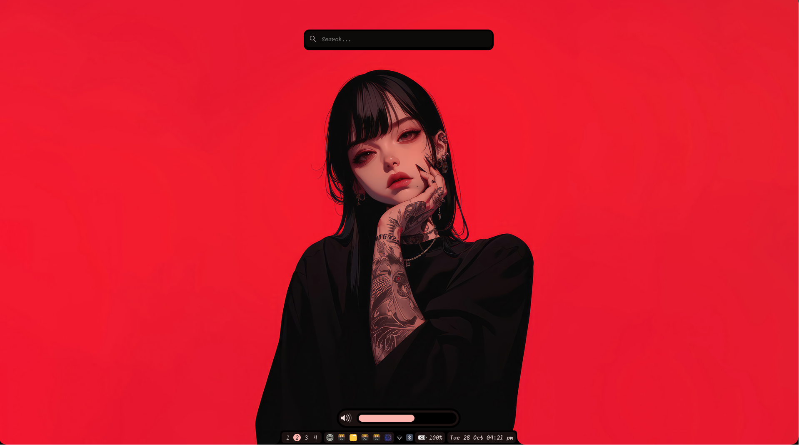

<div align = "center">

<h1><a href="https://github.com/S4NKALP/hyprland">Modus</a></h1>
<p align="center"><sup>A ʜᴀᴄᴋᴀʙʟᴇ ᴀɴᴅ ᴘᴏᴡᴇʀꜰᴜʟ sʜᴇʟʟ ꜰᴏʀ Hʏᴘʀʟᴀɴᴅ, ᴘᴏᴡᴇʀᴇᴅ ʙʏ <a href="https://github.com/Fabric-Development/fabric/">Fᴀʙʀɪᴄ</a>.</sup></p>

<div align="center"><p>


<br>


</div>

## Overview

<h5>
This repository contains my personal dotfiles and configuration files. It is currently in its alpha stage and primarily intended for personal use. As such, it may not be suitable for general use and could undergo significant changes in the future.</h5>

</div>

> [!WARNING]
> This configuration is personal, created specifically for my own preferences and comfort. It is not intended to be universally appealing, but rather customized for my own use. Please note that this project is very much a work in progress (WIP).

> [!NOTE]
> Please be aware that this repository is in an experimental phase and subject to frequent updates. The structure and configurations may evolve drastically over time.



## Packages

```sh
python-setproctitle, python-fabric-git, fabric-cli-git, grimblast, wf-recoder, brightnessctl, gnome-bluetooth-3.0 cliphist, python-psutil python-loguru, adw-gtk-theme, power-profile-daemon, python-materialyoucolor-git, python-pywayland, python-pyxdg, python-pillow, python-numpy, python-requests, toml, pillow
```

**font**

```sh
ttf-font-awesome, otf-font-awesome, ttf-material-symbols-variable-git, ttf-google-sans, ttf-opensans, ttf-robot
```

# ToDo

- [x] Add bluetooth widget
- [x] Add shrunner widget
- [ ] Add Network widget
- [ ] Add Notification panel
- [ ] Improve CSS Styling
- [ ] Add Documentation
- [ ] maybe calendar with events
- [ ] New Screenshot
- [ ] Power Manager
