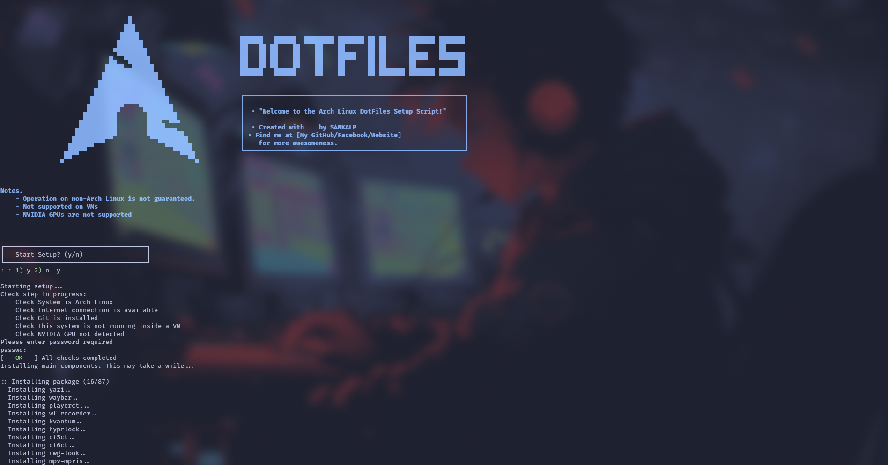

<div align = "center">

<h1><a href="https://github.com/S4NKALP/hyprland">Hyprland with AGS</a></h1>

<a href="https://github.com/S4NKALP/hyprland/blob/main/LICENSE">
 </a>

<a href="https://github.com/S4NKALP/hyprland/graphs/contributors">
 </a>

<a href="https://github.com/S4NKALP/hyprland/stargazers">
</a>

<a href="https://github.com/S4NKALP/hyprland/network/members">
 </a>

<a href="https://github.com/S4NKALP/hyprland/watchers">
 </a>

<a href="https://github.com/S4NKALP/hyprland/pulse">
 </a>

<h3>Hyprland Dots As I use for my daily driver<h3>


<figure>
  
  
  
  
  
  <br/>
</figure>


</div>

## 🌌 Overview

<h3>This repository contains Arch Linux's DotFiles, which I use on a daily basis. <br>
It includes custom settings, aliases, settings for familiar tools, and more to quickly create my ideal work environment on any machine.</h3>
for
<hr>


### ✨ Features

- :dark_sunglasses: Dark Mode for the Whole System
- :bell: Notification Center
- :framed_picture: Various Wallpapers
- :nerd_face: Nerd Fonts for the Shell Prompt
- :iphone: App Launcher
- :keyboard: Multiple Keyboard Layouts
- :car: Automatic mount of USB devices with notification
- :lock: Idle and lock apps
- :open_file_folder: Following XDG Base Directory Standard
- :broom: Organized and cleaned up config files
- :point_up: Screenshot, Clipboard and Wallpaper Picker
- :boom: Performance Mode
- :gear: Various other tweaks & scripts
- :art: Autogenerated Colors
- :window: Fluid Animations
- :sparkles: Ripple Effects


### 🌸 Core System Info

- **OS**: [Arch Linux](https://archlinux.org/) :boom:
- **WM**: [hyprland](https://hyprland.org/) :window:
- **Shell**: [zsh](https://www.zsh.org/) / [starship](https://github.com/starship/starship) :shell:
- **Terminal Emulator**: [kitty](https://sw.kovidgoyal.net/kitty/) :cat:
- **Panel**: [AGS](https://aylur.github.io/ags-docs/) :shaved_ice:
- **Text Editor**: [neovim](https://neovim.io/) / [geany](https://www.geany.org/) :keyboard:
- **App Launcher**: [AGS](https://aylur.github.io/ags-docs/) :rocket:
- **File Manager**: [yazi](https://yazi-rs.github.io/) / [Thunar](https://github.com/neilbrown/thunar) :open_file_folder:
- **Browser**: [firefox](https://www.mozilla.org/) :globe_with_meridians:
- **Colorscheme**: [adw](https://github.com/lassekongo83/adw-gtk3) :art:

---

## 📁 Directory Structure

```

  Dotfiles🌴
    │
    ├─ 📁 assets
    │   └─ screenshot fonts
    ├─ 📁 config
    │   └─ configuration directory
    ├─ 📁 misc
    │   └─ bins/scripts
    ├─ 📁 wallpapers
        └─ wallpapers used for hyprland


```

## :keyboard: Keyboard Shortcuts Guide

```
    Windows + Enter: Open Terminal
    Windows + E: Thunar File Manager
    Windows + D: Application Launcher
    Windows + C: Close Program
    Windows + W: Wallpaper Picker
    Windows + Space: Change Screen Layout Style
    PrtSc: Taking Screentshot
    ALT + F3: Change Keyboard Layout
    ALT + F1: For Keybinds

Other keybinds can be found in ~/dotfiles/hypr/UserConfigs/UserKeybinds.conf
or in ~/dotfiles/hypr/configs/Keybinds.conf

```


# :wrench: ‎ <samp>Setup</samp>

<b> ArchInstall </b>
* Using ArchInstall Script Install Archlinux on bare metal.
* After Booting into HyprLand, Open terminal and install Aur Helper called Paru
### :package: <samp>Automatic Installation (Arch Linux)</samp>

<figure>
    
</figure>

```
git clone -b AGS https://github.com/S4NKALP/hyprland.git
cd hyprland
chmod +x setup
./setup
```

### 🧰 Tools Used

> I got a lot of the code for AGS from [koeqaife/hyprland-material-you](https://github.com/koeqaife/hyprland-material-you)

- [nvim](https://github.com/S4NKALP/nvim) — Personalized Editor
- [blog](https://github.com/S4NKALP/blog) — Blog
<hr>

<div align="center">

<strong>⭐ hit the star button if you found this useful ⭐</strong><br>

</div>
If you have any questions, issues, or suggestions, feel free to let us know by opening an issue. Your feedback is greatly appreciated!

<div align ="center">
    <strong>Thank you for your support as well🦊</strong>
</div>
