# HyprLand
<b> HyprLand Setup  </b>

<b> ArchInstall </b>
* Using ArchInstall Script Install Archlinux on bare metal.
* After Booting into HyprLand, Open terminal and install Aur Helper called Paru

<b> Install Paru (Aur Helper)</b>

```
git clone https://aur.archlinux.org/paru-bin.git
```
* cd paru-bin

* makepkg -Si

<b> Installing automatically</b>

```
curl https://raw.githubusercontent.com/S4NKALP/hyprland/main/Installer.sh -o $HOME/Installer
chmod +x Installer.sh
./Installer
```

<details>
<summary><h3>Manual Installation</h3></summary>

<b> Dependency

```
paru -S fnm hyprland keyb rofi-file-browser-extended-git imv brightnessctl yazi waybar playerctl wf-recorder kvantum swaylock-effects-git qt5ct qt6ct nwg-look mpv-mpris pacman-contrib swayidle pavucontrol pamixer file-roller adobe-source-code-pro-fonts ttf-fira-code ttf-jetbrains-mono-nerd ttf-jetbrains-mono noto-fonts-emoji otf-font-awesome ttf-cascadia-code-nerd ttf-bitstream-vera ttf-croscore ttf-dejavu ttf-droid ttf-ibm-plex ttf-liberation noto-fonts gnu-free-fonts linux-headers alsa-utils less wlroots thunar thunar-volman thunar-archive-plugin udiskie mtpfs jmtpfs gvfs-gphoto2 gvfs-mtp rofi-lbonn-wayland-git network-manager-applet lsd cava geany geany-plugin swaync tumbler unzip zip unrar polkit-gnome xdg-user-dirs grim slurp jq polkit-kde-agent zathura-pdf-mupdf zathura yt-dlp ffmpegthumbnailer xdotool wmctrl zsh lazygit xdg-desktop-portal-gtk gtk-engine-murrine lxappearance xsel bc clipshit bluez bluez-utils swww kitty imagemagick
```

<b> Install GTK Themes,Icons,Cursor


* Dotfiles

```
cd Downloads
git clone https://github.com/S4NKALP/hyprland.git

cd hyprland
cp -r wallpapers ~/Pictures
cp -r config/* ~/.config
cp -r misc/bin ~/.local
cp -r misc/.zshenv ~/

chmod +x ~/.config/hypr/scripts/*
```

* GTK Themes

 ```
git clone https://github.com/Fausto-Korpsvart/Tokyo-Night-GTK-Theme.git
sudo cp -r Tokyo-Night-GTK-Theme/themes/Tokyonight-Dark-BL-LB /usr/share/themes/
sudo cp -r Tokyo-Night-GTK-Theme/icons/Tokyonight-Dark /usr/share/icons/

sudo tar -xf "assets/Bibata-Modern-Ice.tar.xz" -C /usr/share/icons/
```

```
After this Press SUPER + SHIFT + W and choose wallpaper And Restart Your System and boom!
```
</details>
## Credits
Built on top of : [JakooLit](https://github.com/JaKooLit/Hyprland-Dots)

<details>
<summary><i>
📸 Screenshots
</i></summary>
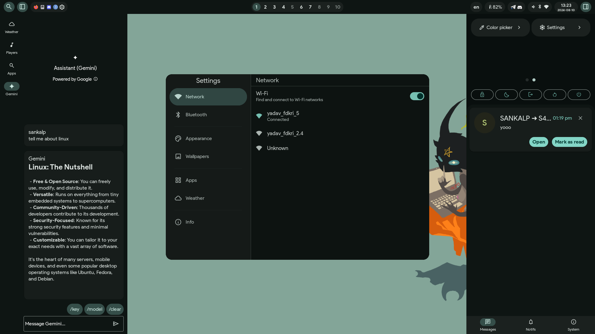
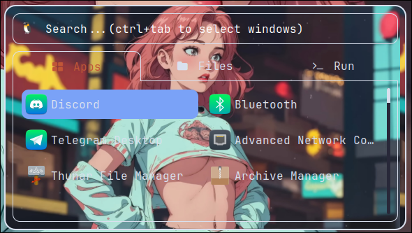
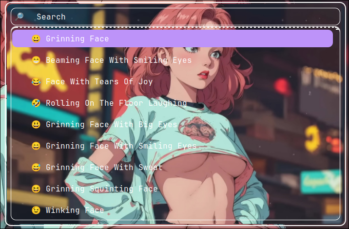
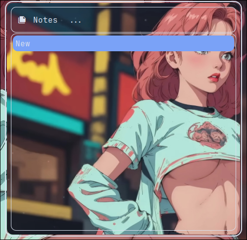
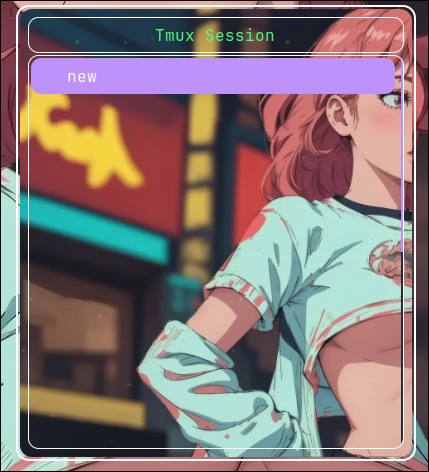
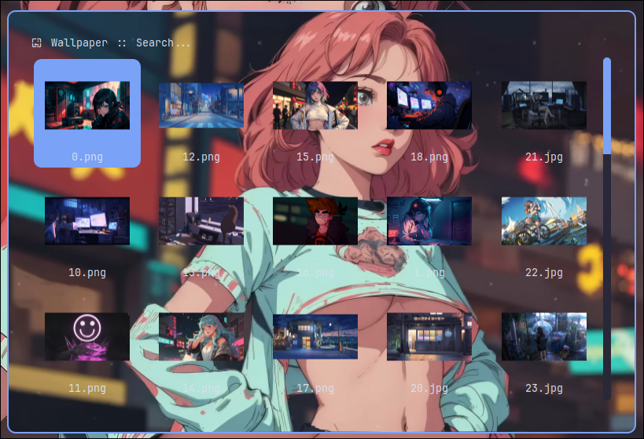
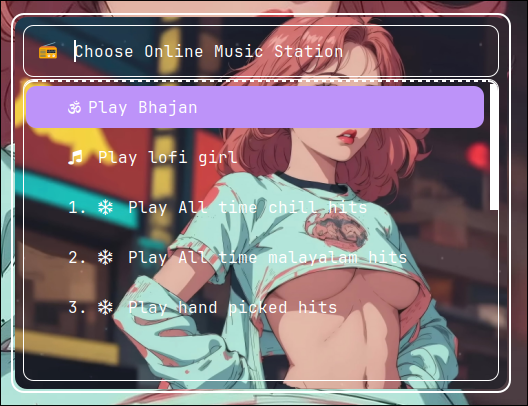
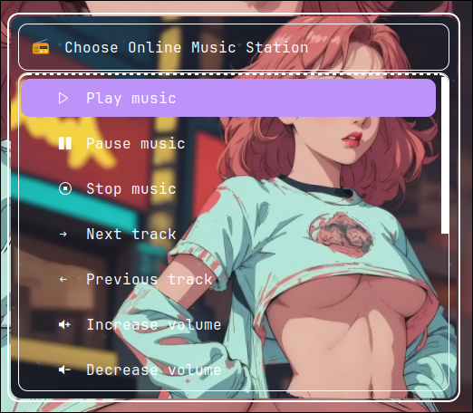
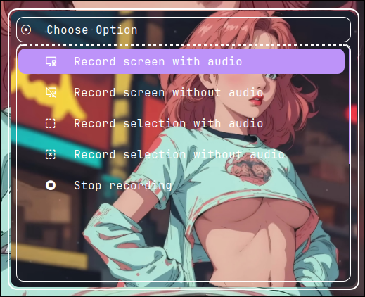
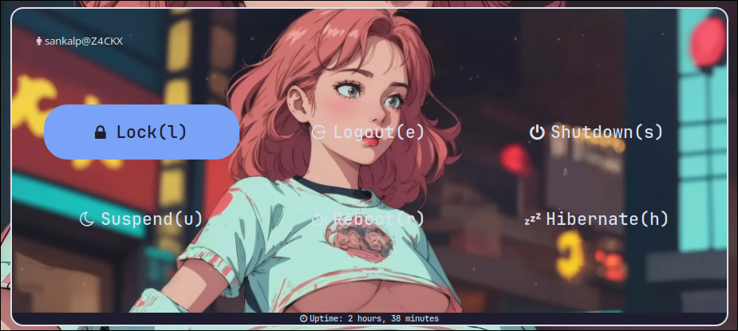
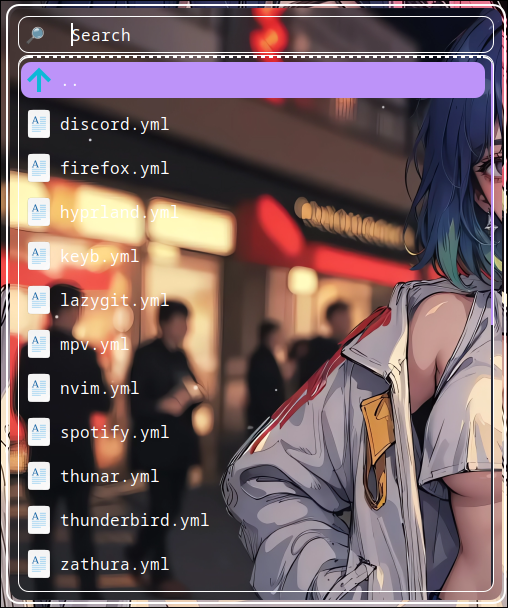


</details>

