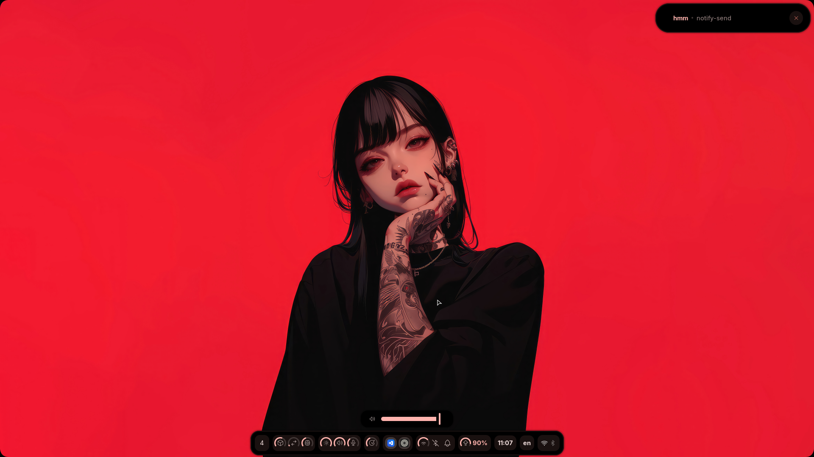

> [!WARNING]
> This configuration is made by myself, for myself, and with very little concern for other's preferences. This configuration is not meant to be "good", it's just meant to be comfortable for me. Let it also known that this is _VERY_ WIP.

<div align = "center">

<h1><a href="https://github.com/S4NKALP/hyprland">Hyprland</a></h1>

<div align="center"><p>


<br>


</div>

## Overview

<h4>This repository contains my personal dotfiles and configuration files. It's currently in an early, experimental phase and may not be suitable for general use.</h4>

</div>

> [!NOTE]
> This repository is in the alpha stage and primarily for personal use. The organization and configurations may change significantly in the future.



#### Build with **[Fabric](https://github.com/Fabric-Development/fabric)**

## Packages

```sh
python-setproctitle, python-fabric-git, fabric-cli-git, grimblast, wf-recoder, brightnessctl, gnome-bluetooth-3.0 cliphist, python-psutil python-loguru, adw-gtk-theme, power-profile-daemon, python-materialyoucolor-git, python-pywayland, python-pyxdg, python-pillow, python-numpy, python-requests,
```

**font**

```sh
ttf-font-awesome, otf-font-awesome, ttf-material-symbols-variable-git, ttf-google-sans, ttf-opensans, ttf-robot
```

# ToDo

- [x] Add bluetooth widget
- [x] Add shrunner widget
- [ ] Add wifi widget
- [ ] Dashboard
- [ ] Notification panel
- [ ] Better css
- [ ] Documentation
- [ ] maybe calendar with events
- [ ] Audio and Brightness Controller
- [ ] New Screenshot
