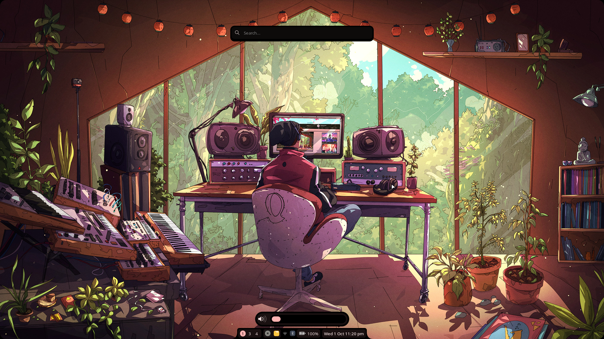

# ⚙️ Modus

> **Status**: Always a Work in Progress 🛠️

> **Not optimized**, could use more memory and CPU than expected

This shell setup is intentionally crafted to reflect my personal taste in both aesthetics and workflow.
It includes core components like a panel, launcher, OSD, and hot-reloadable configurations — all optimized for speed, minimalism, and keyboard-centric interaction.

---

## ✅ Core Features

- [x] Hot reload (no shell restart required)
- [x] Panel
- [x] On-Screen Display (OSD)
- [x] Launcher
- [x] Notification popups

---

## 🔎 Launcher Plugins — Quick Reference

For full details, see the plugin docs in [Plugin.md](./assets/Plugin.md).

| Plugin          | Keyword | What it does / commands                                                | Semicolon Required       |
| --------------- | ------- | ---------------------------------------------------------------------- | ------------------------ |
| Application     | —       | Application search (default when no keyword matches)                   | No                       |
| Bookmark        | `bm`    | `add`, `remove`, `update`                                              | Yes                      |
| Calculator      | `calc`  | Mathematical expressions                                               | No                       |
| Clipboard       | `clip`  | Clipboard history                                                      | No                       |
| Emoji           | `em`    | Emoji search                                                           | No                       |
| Google Lens     | `lens`  | Capture region and search                                              | No                       |
| Google Search   | `gg`    | Web search                                                             | No                       |
| YouTube Search  | `yt`    | YouTube search                                                         | No                       |
| Link Opener     | `lk`    | Open a URL                                                             | No                       |
| Color Picker    | `color` | Pick color as HEX/RGB/HSV                                              | No                       |
| OTP             | `otp`   | `add`, `remove`                                                        | No                       |
| Bluetooth       | `bt`    | `power`, `scan`, `connect`, `disconnect`                               | Yes                      |
| Password        | `pass`  | `add`, `remove`, `update`; auto-prompt for master password when needed | Yes (lock/help/list: No) |
| Power Menu      | `pm`    | Power options                                                          | No                       |
| Power Profile   | `power` | Power profiles                                                         | No                       |
| Caffeine        | `caff`  | On, off, custom durations (30m, 1h, 45s, 600)                          | No                       |
| Reminder        | `rem`   | Presets, custom times (`10m`, `1h30m`, `21:30`), optional message      | No                       |
| Todo            | `todo`  | `add`, `done`, `remove`, `edit`, `clear`                               | Yes (except `clear`)     |
| Tmux            | `tmux`  | `new`, `kill`, `rename`, `terminal`                                    | Yes (except `terminal`)  |
| Wallpaper       | `wall`  | Wallpaper browsing                                                     | No                       |
| Window Switcher | `win`   | Window switching                                                       | No                       |
| SSH Manager     | `ssh`   | SSH hosts, `terminal`, `help`                                          | No                       |
| Network Manager | `net`   | Scan, connect, disconnect, forget                                      | No                       |

---

Note: `wr` applies a random wallpaper immediately.

## 🧩 Launcher Plugins — Completed

The launcher supports modular plugins to extend functionality. Current plugins include:

- [x] OTP Manager
- [x] Pass Manager
- [x] Tmux Session Manager
- [x] Bookmark Manager
- [x] Power Profile Manager
- [x] Window Switcher
- [x] Power Menu
- [x] Todo Manager
- [x] Screen Capture Tool
- [x] Clipboard History Viewer
- [x] Emoji Picker
- [x] Wallpaper Picker
- [x] Calculator & Unit Converter
- [x] Caffeine Manager
- [x] SSH Session Manager
- [x] Color Picker
- [x] Reminder
- [x] Network Manager
- [x] Bluetooth Manager
- [x] Google Lens

---

## 🧩 Launcher Plugins — Planned

Planned plugins to further enhance productivity and system control:

- [ ] Calendar with Event Reminders
- [ ] Notification Manager

---

## 🙏 Special Thanks

A heartfelt thank you to the following people for their incredible contributions, ideas, and inspiration. Your work has been a huge part of shaping this shell!

- [darsh](https://github.com/its-darsh) for creating [**Fabric**](https://github.com/Fabric-Development/fabric/) and the [**Fabrika**](https://github.com/its-darsh/fabrika) config, which served as the foundation for the **Launcher** and **OSD** in this shell.

- [gummy bear album](https://github.com/muhchaudhary) for sharing clever code snippets and useful services that saved countless hours of development.

- [axenide](https://github.com/Axenide) for an inspiring config full of unique ideas, some of which I couldn’t resist adapting and integrating into my own setup.

---

## 📝 License

This project is licensed under the [GNU General Public License](https://www.gnu.org/licenses/gpl-3.0.html) (GPL v3 or later).
See the [LICENSE](./LICENSE) file for full details.

---
